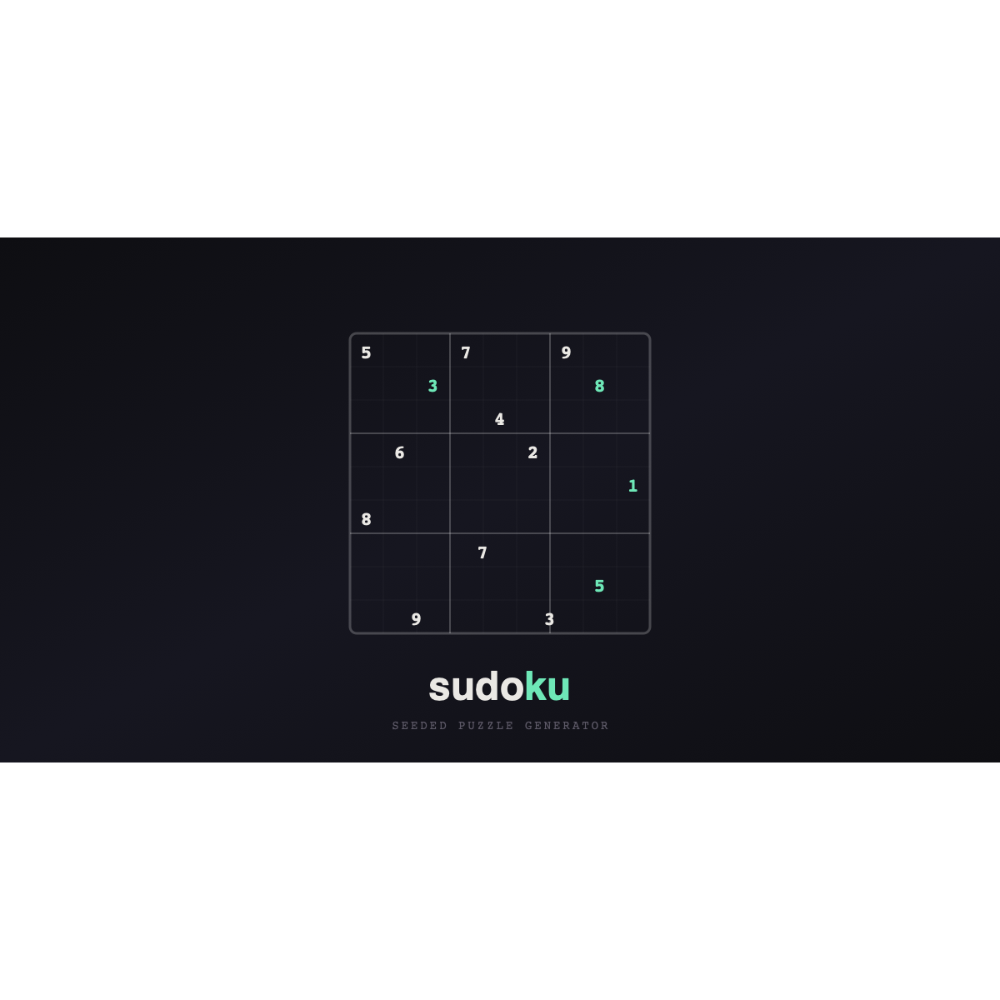

# sudoku

A sleek, seeded Sudoku puzzle generator with real-time multiplayer — built with Vue 3, Vite, and Tailwind CSS v4.

**[Play it live](https://asmerkin.github.io/sudoku/)**



## Features

- **Seeded puzzles** — every seed produces a unique, deterministic board you can share with friends
- **4 difficulty levels** — Easy, Medium, Hard, Very Hard
- **Real-time multiplayer** — peer-to-peer via WebRTC (PeerJS), with live cursors, color-coded players, and ranking on completion
- **Notes mode** — pencil marks for candidates
- **Undo** — full move history with Ctrl+Z / Cmd+Z
- **Error tracking** — highlights mistakes and counts them
- **Timer** — track your solve time
- **Print** — generate 6 puzzles + solutions per seed at any difficulty
- **Dark / Light theme** — toggle with automatic persistence
- **Bilingual** — English and Spanish with browser auto-detection
- **Mobile-friendly** — responsive layout with on-screen numpad

## Keyboard shortcuts

| Key | Action |
|-----|--------|
| `1`–`9` | Place number |
| `Arrow keys` | Move selection |
| `N` | Toggle notes mode |
| `Backspace` / `Delete` | Erase cell |
| `Ctrl+Z` / `Cmd+Z` | Undo |

## Tech stack

| | |
|--|--|
| Framework | [Vue 3](https://vuejs.org/) with `<script setup>` SFCs |
| Build | [Vite 6](https://vite.dev/) |
| Styling | [Tailwind CSS v4](https://tailwindcss.com/) |
| Multiplayer | [PeerJS](https://peerjs.com/) (WebRTC) |
| Fonts | [Outfit](https://fonts.google.com/specimen/Outfit) + [JetBrains Mono](https://fonts.google.com/specimen/JetBrains+Mono) |
| Deploy | GitHub Pages via GitHub Actions |

## Getting started

```bash
# install dependencies
npm install

# start dev server (http://localhost:5173)
npm run dev

# build for production
npm run build

# preview production build
npm run preview
```

## How multiplayer works

1. One player creates a room and shares the link
2. Others join via the link — each gets a unique color
3. The host relays all moves and cursor positions to every player in real-time
4. When the puzzle is solved, a ranking shows each player's contributions and mistakes

## License

MIT
